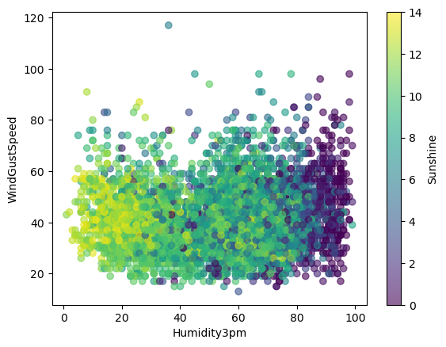

# ATIVIDADE PRÁTICA - ÁRVORE DE DECISÃO

Nesta atividade prática, carregamos e limpamos os dados meteorológicos, codificamos variáveis categóricas, dividimos os dados em conjuntos de treinamento e teste, criamos e treinamos um modelo de árvore de decisão e avaliamos o desempenho do modelo.

Após o pré-processamento dos dados e a codificação das variáveis categóricas, preparamos a variável alvo codificando a coluna 'RainTomorrow'. Em seguida, procedeu-se ao treinamento do modelo de árvore de decisão usando os dados de treinamento.

Finalmente, avaliamos o desempenho do modelo calculando seu escore de precisão nos dados de treinamento. O modelo alcançou uma precisão de 81%.

Para desenvolver a solução de aprendizado de máquina baseada em Árvore de Decisão para classificar se vai chover amanhã ou não, com base em dados meteorológicos.

Árvore de decisão é um tipo de algoritmo de aprendizado de máquina supervisionado que pode lidar com variáveis numéricas e categóricas. Nessa atividade foi usado a biblioteca scikit-learn para implementar da árvore de decisão em Python.

Os dados foram obtidos do Kaggle: [https://www.kaggle.com/datasets/rever3nd/weather-data?resource=download](https://www.kaggle.com/datasets/rever3nd/weather-data?resource=download)

- **Data**: A data da observação do tempo.
- **Localização**: O local onde os dados meteorológicos foram registrados.
- **MinTemp**: A temperatura mínima registrada nesse dia, que é de em graus Celsius.
- **MaxTemp**: A temperatura máxima registrada nesse dia, que é de em graus Celsius.
- **Precipitação**: A quantidade de chuva medida em milímetros, que é em mm.
- **Evaporação**: A quantidade de água evaporada do solo ou de outras superfícies durante o dia.
- **Sol**: O número de horas de sol registradas durante o dia.
- **WindGustDir**: A direção de onde se originou a rajada de vento mais forte, neste caso.
- **WindGustSpeed**: A velocidade da rajada de vento mais forte medida em quilômetros por hora, que é em km/h.
- **WindDir9am**: A direção do vento às 9h.
- **WindDir3pm**: A direção do vento às 3h.
- **WindSpeed9h**: A velocidade do vento às 9h, que é em km/h.
- **WindSpeed3h**: A velocidade do vento às 3h, que é em km/h.
- **Umidade9h**: A umidade relativa do ar às 9h, que é em %.
- **Umidade3h**: A umidade relativa do ar às 3h, que é em %.
- **Pressão9h**: A pressão atmosférica às 9h, que é em hPa.
- **Pressão3h**: A pressão atmosférica às 3h, que é em hPa.
- **Nuvens9h**: A fração de céu coberta por nuvens às 9h.
- **Nuvens3h**: A fração do céu coberta de nuvens às 3h.
- **Temp9am**: A temperatura às 9h, que é em graus Celsius.
- **Temp3pm**: A temperatura às 3h, que é em graus Celsius.
- **ChuvaHoje**: Indica se choveu naquele dia (Sim) ou não (Não).
- **RISK_MM**: A quantidade de chuva registrada em milímetros para o dia seguinte. É uma medida do risco ou possibilidade de chuva.
- **RainTomorrow**: Indica se choveu no dia seguinte (Sim) ou não (Não).

Na primeira parte, é carregado os dados meteorológicos do arquivo CSV. Os dados contêm informações sobre a localização, data, temperatura, umidade, vento, chuva e outras variáveis meteorológicas de várias cidades da Austrália. O objetivo é prever se vai chover amanhã ou não, com base nessas variáveis. A coluna 'RainTomorrow' é a variável de destino.

| FIELD1 | Date       | Location | MinTemp | MaxTemp | Rainfall | Evaporation | Sunshine | WindGustDir | WindGustSpeed | WindDir9am | WindDir3pm | WindSpeed9am | WindSpeed3pm | Humidity9am | Humidity3pm | Pressure9am | Pressure3pm | Cloud9am | Cloud3pm | Temp9am | Temp3pm | RainToday | RISK_MM | RainTomorrow |
| ------ | ---------- | -------- | ------- | ------- | -------- | ----------- | -------- | ----------- | ------------- | ---------- | ---------- | ------------ | ------------ | ----------- | ----------- | ----------- | ----------- | -------- | -------- | ------- | ------- | --------- | ------- | ------------ |
| 0      | 2008-12-01 | Albury   | 13.4    | 22.9    | 0.6      |             |          | W           | 44.0          | W          | WNW        | 20.0         | 24.0         | 71.0        | 22.0        | 1007.7      | 1007.1      | 8.0      |          | 16.9    | 21.8    | No        | 0.0     | No           |
| 5939   | 2009-01-01 | Cobar    | 17.9    | 35.2    | 0.0      | 12.0        | 12.3     | SSW         | 48.0          | ENE        | SW         | 6.0          | 20.0         | 20.0        | 13.0        | 1006.3      | 1004.4      | 2.0      | 5.0      | 26.6    | 33.4    | No        | 0.0     | No           |



Podemos ver que há algumas colunas que são do tipo object, que significa que são variáveis categóricas, como 'Location', 'WindGustDir', 'RainToday' e 'RainTomorrow'. Uma árvore de decisão pode lidar com variáveis categóricas diretamente, mas para facilitar a implementação em Python, vamos usar o LabelEncoder para codificar essas variáveis para valores numéricos. Também podemos ver que há alguns valores ausentes (NaN) nas colunas 'Evaporation', 'Sunshine' e 'Cloud'.

Também foi convertido a coluna 'Date' para o tipo número, pois é uma variável temporal que pode ter alguma influência na previsão.

Agora, vamos preparar a variável de destino codificando a coluna 'RainTomorrow' da mesma forma.

Para avaliar o desempenho do modelo, vamos calcular a pontuação de precisão do modelo nos dados de treinamento.

Após executar esses passos, obteve-se uma precisão de 81% no conjunto de treinamento. Isso significa que o modelo foi capaz de classificar corretamente 81% dos exemplos de teste. No entanto, é importante ressaltar que é necessário avaliar o desempenho do modelo em um conjunto de teste separado para ter uma estimativa mais precisa de sua capacidade de generalização.

## Referências

```py
@article{scikit-learn,
  title={Scikit-learn: Machine Learning in {P}ython},
  author={Pedregosa, F. and Varoquaux, G. and Gramfort, A. and Michel, V.
         and Thirion, B. and Grisel, O. and Blondel, M. and Prettenhofer, P.
         and Weiss, R. and Dubourg, V. and Vanderplas, J. and Passos, A. and
         Cournapeau, D. and Brucher, M. and Perrot, M. and Duchesnay, E.},
  journal={Journal of Machine Learning Research},
  volume={12},
  pages={2825--2830},
  year={2011}
}

@misc{Deekshitulu_2023,
 title={Weather_Data},
 url={https://www.kaggle.com/datasets/rever3nd/weather-data?resource=download},
 journal={Kaggle},
 author={Deekshitulu, Ruthvik Srinivas},
 year={2023},
 month={Apr}
}
```
